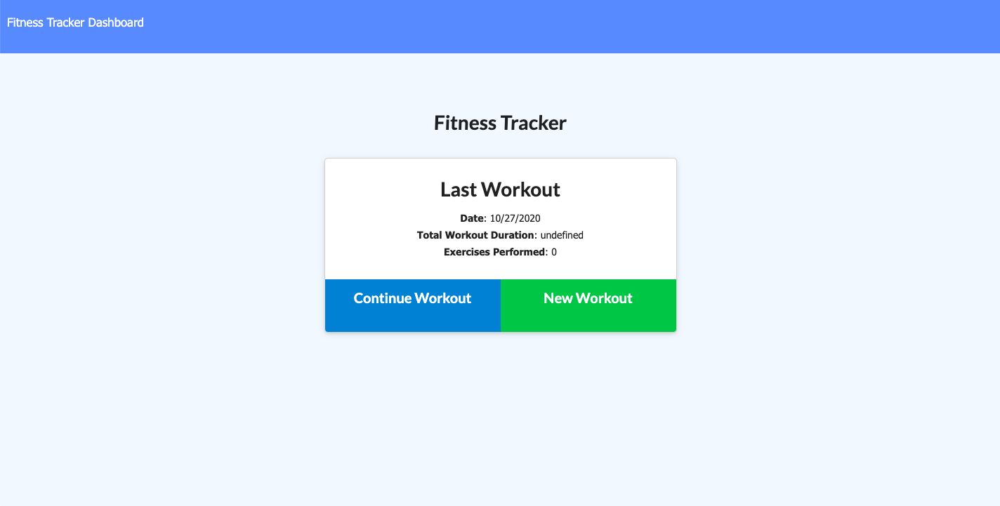
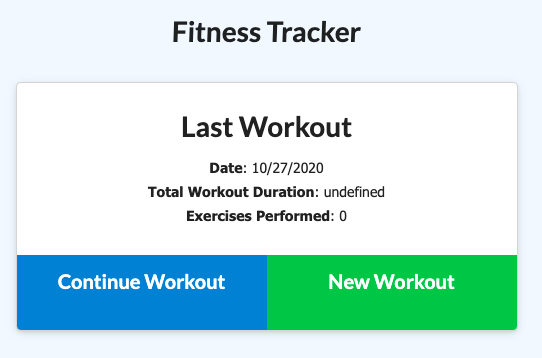
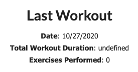
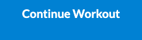
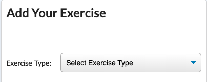
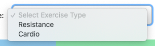
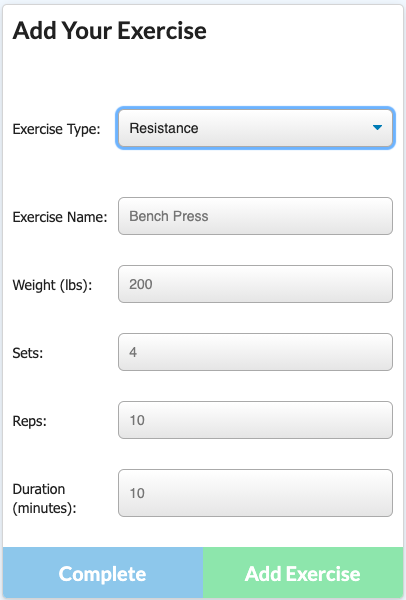
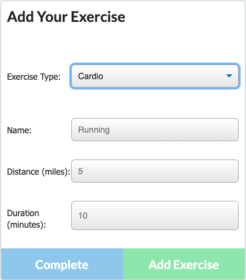
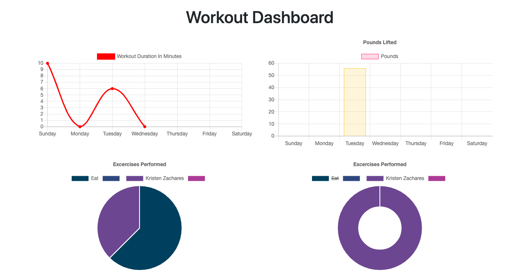

# Fitness Tracker

## This app is meant to assist the user in tracking their workouts.

[Click Here To Use It](https://arcane-beach-69150.herokuapp.com)

When you first go the website, you'll be greeted with a landing page

Focus on the Main Menu for now, located in the center of the home page.

It will display the details of your last workout, if you've used the app before.

*If it's your first time using the app this field will be blank.

You can choose to add a workout to your current workout routine.

Or start a new routine.

Either way, you'll then be sent to the page where you can select your exercise.

You'll need to select with type of exercise you want to do, then input the information about the exercise in the text field provided.

You can choose between Resistance Training...

...and Cardio Training.

To see the results of your workout, click the "Dashboard" button on the navigation bar.

Your results will be displayed as a series of graphs.

Happy Exercising! :)